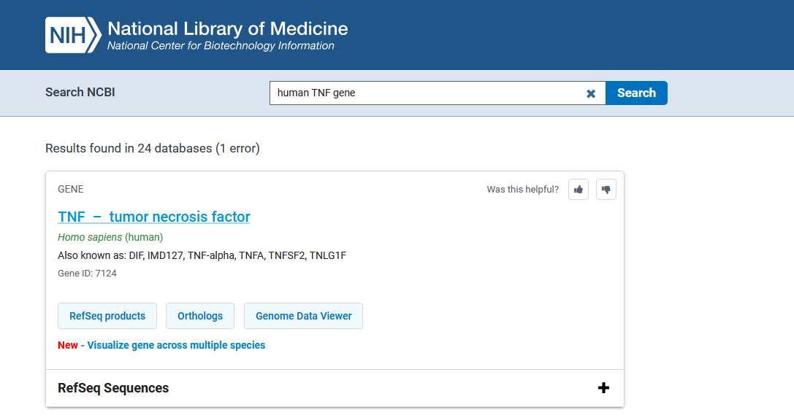
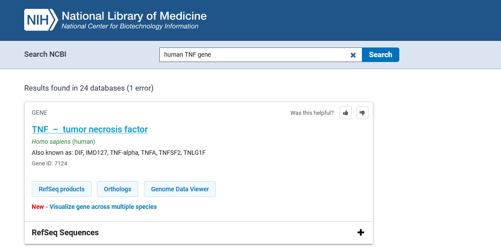
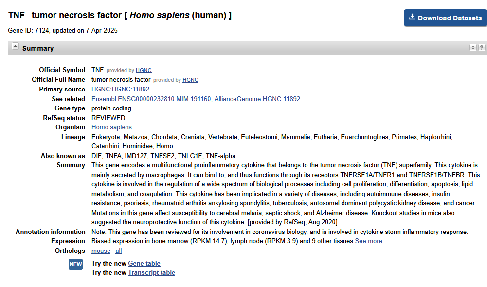
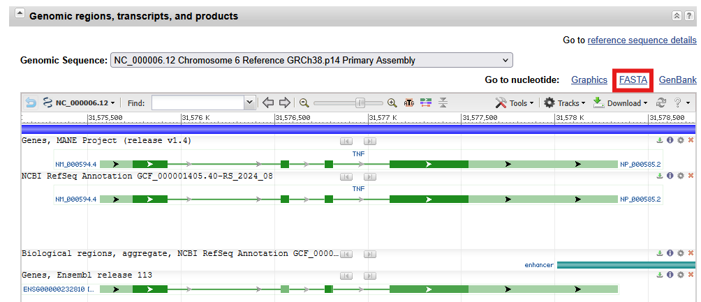
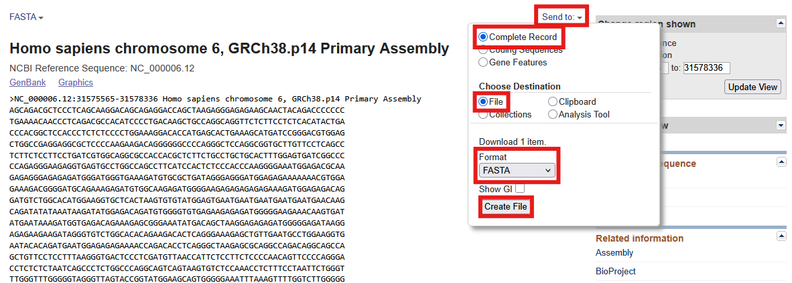
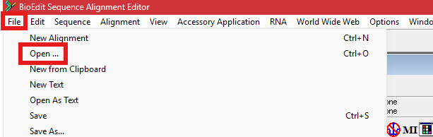
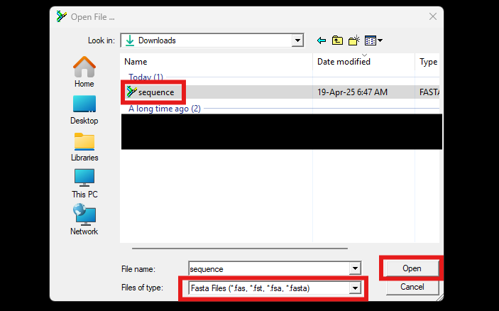
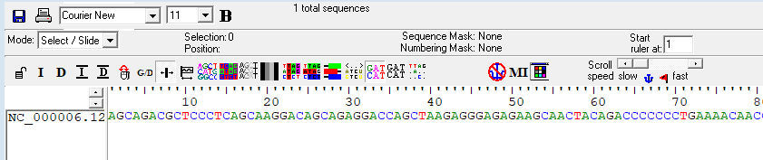

# Task 1: Download a Biological Sequence from NCBI and View/Edit It:

### 1A] On the [NCBI website](https://www.ncbi.nlm.nih.gov/), search for 'human TNF gene'

### 1B] Select the sequence record

### 1C] Download the sequence in FASTA format

> On the sequence record page, scroll down to the "Genomic regions, transcripts, and products" section. Then click on 'FASTA'.

> Select 'Send to' -> 'Complete record' -> 'File' -> 'FASTA' -> 'Create file'.

### 1D] Open and view the sequence using [BioEdit](https://bioedit.software.informer.com/)

> After starting up BioEdit, Click on 'File' -> 'Open...'.

> Select the TNF sequence FASTA file (if the file does not appear, ensure 'Files of type' is set to 'All files' or 'FASTA files'). Then, open the file.

> The sequence should now be displayed in the main window

---

### Proceed to task 2
