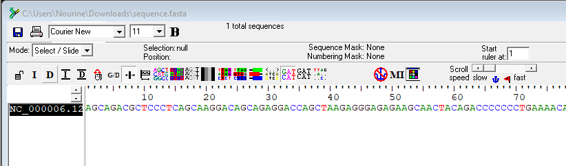
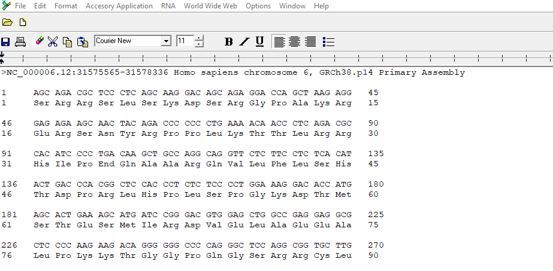

# Task 2: Generate a Translation of a DNA or RNA Sequence into Amino Acids

## **Objective:** Translate the DNA sequence of the TNF gene into an amino acid sequence.

### 2A] Use the 'Translate' feature in BioEdit to generate the amino acid sequence.

> Select 'Sequence' -> 'Nucleic acid' -> 'Translate' -> 'Frame 1'

---

### Proceed to [task 3](Task3.md)
