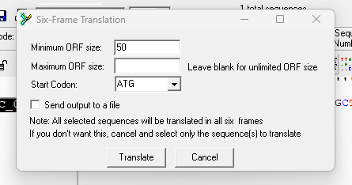
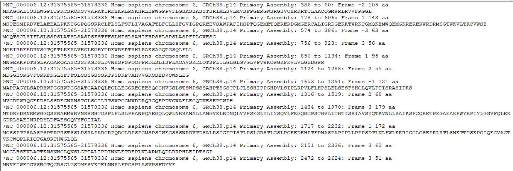

# Task 3: Find ORFs (Open Reading Frames) in a DNA or RNA Sequence

## **Objective:** Identify the ORFs within the TNF gene sequence.

### 3A] Use BioEdit's ORF Finder tool to find ORFs in the TNF gene sequence.

> Highlight the sequence's name, select 'Sequence' -> 'Nucleic acid' -> 'Sorted six-frame translation'

> Set minimum ORF size to 50 (to filter out noise). Then set start codon to 'ATG'

### 3B] Record the start and stop positions, lengths, and protein translations of the ORFs.

> Translation output:

| ORF no. | Frame | Start position | Stop position | Length (nt) | Length (aa)|
|:--------|:------|:---------------|:--------------|:------------|:-----------|
|1|-2|386|60   |327|109|
|2|1|178|606   |429|143|
|3|-3|574|386  |189|63|
|4|3|756|923   |168|56|
|5|1|850|1134  |285|95|
|6|2|1124|1288 |165|55|
|7|-1|1653|1291|363|121|
|8|2|1316|1519 |204|68|
|9|3|1434|1970 |537|179|
|10|1|1717|2232|516|172|
|11|3|2151|2336|186|62|
|12|3|2472|2624|153|51|

### Interpretation:

> The longer ORFs are more likely to be protein-coding regions (e.g. ORFs no. 9 and 10).
> The shorter ones (e.g. ORF no. 12) are more likely to be noise.
> The identified ORFs are present on both strands.
> The forward strand (frames 1, 2, and +3) yielded nine ORFs, whereas the reverse strand (–1, –2, and –3) yielded only three mid‑sized ORFs, indicating more coding potential in the annotated sense direction.
> We seem to be dealing with a gene-dense locus with a number of compelling ORFs. Further analyses needed.

---

### Proceed to [task 4](Task4.md)
