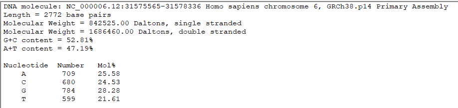
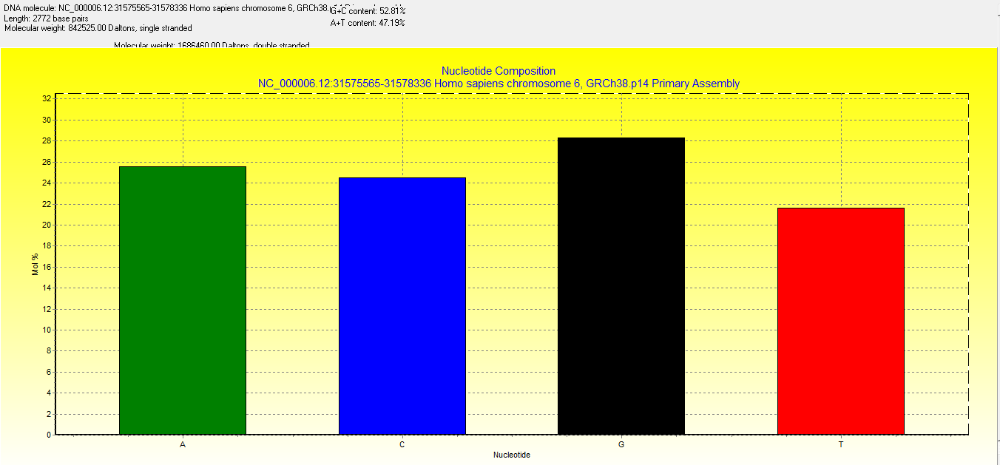

# Task 4: Analyze Sequence Composition (Nucleotide or Amino Acid Frequencies)

## Objective: Analyze the nucleotide composition of the TNF gene sequence.

### 4A] Use BioEdit to analyze the sequence composition of the TNF gene. Calculate the frequencies of each nucleotide and the overall GC content.

> Select 'Sequence' -> 'Nucleic acid' -> 'Nucleotide composition'

> Save the analysis in a TXT file by clicking the floppy disk icon in the nucleotide composition dialogue box.

### Interpretation

> Moderate GC content (52.81%), good for primer design.

> GC content also indicates a potential overlap with a CpG island?

> Both the GC skew [(G–C)/(G+C)=(784–680)/(784+680)=0.07] and the AT skew [(A–T)/(A+T)=(709–599)/(709+599)=0.08] are positive, typical of the leading strand in human genes.

> Highly expressed genes often show moderate GC% in coding regions, consistent with the expression levels of TNF in immune cells.

> Given the GC content, the sequence likely contains a good amount of restriction sites.

---

### Proceed to [Task 5](Task5.md)
