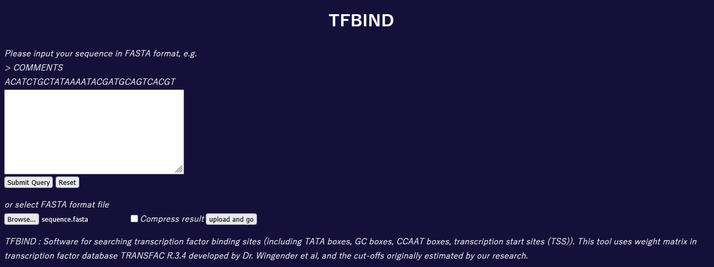
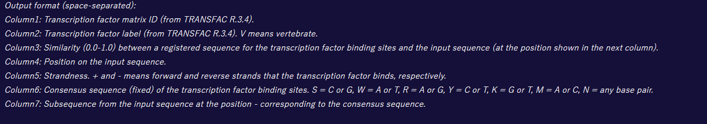
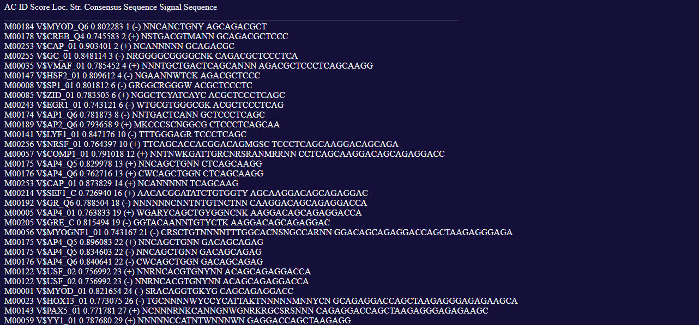

# Task 5: Identify Transcription Factor Binding Sites

## Objective: Identify potential transcription factor binding sites in the TNF gene promoter region.

### N.B.: This task was originally supposed to be done using the PROMO tool, which is unfortunately no longer up and running. Instead, I will be using the [TFBIND tool](https://tfbind.hgc.jp/). 

### 5A] Access the TFBIND website, upload the TNF sequence in FASTA format, and run the tool

### Results + interpretation

> TFBIND returned a large number of motifs with a score greater than 0.8.

> Many of the uncovered motifs belong to groups such as bZIP (e.g. CREB), bHLH (e.g. MYoD), and homeobox (e.g. HOX13).

> Many of the transcription factors are overlapping, suggesting the presence of regulatory modules.

---

### Proceed to [Task 6](Task6.md).
