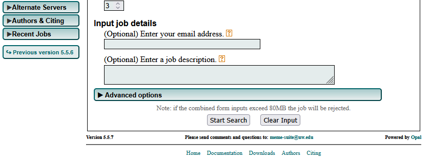

# Task 6: Search for Functional Motifs in a Genome or Transcriptome Using MEME Suite

## Objective: Search for functional motifs in the TNF gene sequence using MEME Suite.

### 6A] Access the [MEME suite](https://meme-suite.org/meme/)

### 6B] On the MEME homepage, select 'MEME'.

### 6C] Upload TNF sequence in FASTA format, keep default settings [N.B: for motif site distribution, select 'any number of repetitions'].

### 6D] Select 'Start search' and wait for job to finish.

### Results + Interpretation

> MEME returned three de novo motifs in the TNF sequence.

> Motif 1 seems to be the most biologically meaningful, with an E-value of 2.6e.

> Motif 1 appears at 5 distinct positions, which may indicate a multi-site regulatory element in the TNF promoter.

> The location of motif 1 is around ~400bp upstream of the promoter, consistent with typical promoter elements

> These results also confirm the GC bias identified in previous tasks.

---

### Procceed to [task 7](Task7.md).
