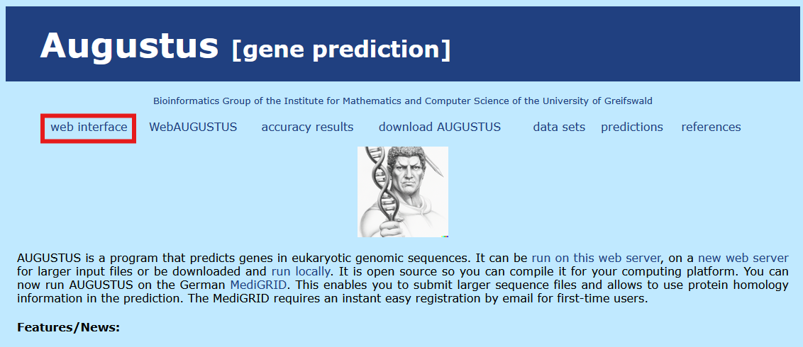
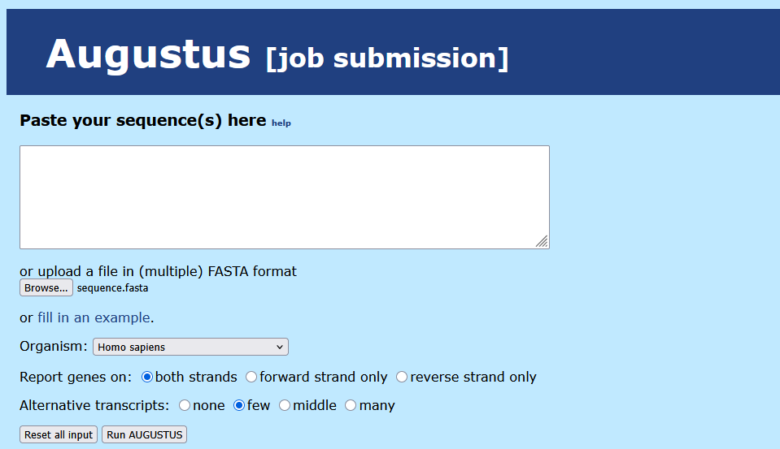

# Task 7: Predict Coding/Non-Coding Regions in a Genome

## Objective: Predict the coding and non-coding regions within the TNF gene sequence.

### N.B.: This task was originally supposed to be done with the GENSCAN tool, but at the time of doing this task, the GENSCAN server is down. Instead, I will be using the Augustus tool.

### 7A] Access the [Augustus tool](https://bioinf.uni-greifswald.de/augustus/) and select 'web interface'

### 7B] Upload the TNF sequence in FASTA format, keep default settings, and run Augustus

### Results + Interpretation

> Augustus predicted a gene (g1) on both strands.

> The predicted protein sequence is 228 amino acids long, which is close to the number of amino acids found in the TNF protein sequence (233 AAs) reported in literature.

> 4 coding sequences (CDS) were identified at the following positions: 1] 193–363, 2] 970–1015, 3] 1203–1250, 4] 1552–1973.

> The sequences between the 4 CDS are classified as introns. Also consistent with the literature [TNF-gene contains three introns and four exons](https://www.researchgate.net/figure/Structure-of-the-TNF-gene-and-TNF-constructs-A-structure-of-the-TNF-gene-The-coding_fig1_5800312). 

> Augustus' predictions are mostly consistent with the available literature on the TNF genes.

---

### Proceed to [task 8](Task8.md)
