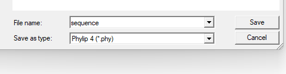
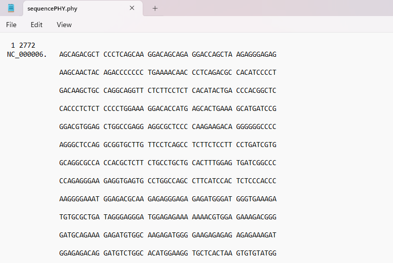

# Task 8: Convert Between Sequence File Formats Using BioEdit (FASTA to PHYLIP)

## Objective: Convert the TNF gene sequence from FASTA format to PHYLIP format.

### 8A] Open BioEdit and load the TNF sequence in FASTA format

> After starting up BioEdit, Click on 'File' -> 'Open...'.

> Select the TNF sequence FASTA file (if the file does not appear, ensure 'Files of type' is set to 'All files' or 'FASTA files'). Then, open the file.

> The sequence should now be displayed in the main window.

### 8B] Use the 'Save As...' feature to convert the file to PHYLIP format

> Select 'File' -> 'Save as..'.

> Change 'Save as type' to 'PHYLIP'.

### 8C] Verify the conversion by opening the PHYLIP file in a text editor

